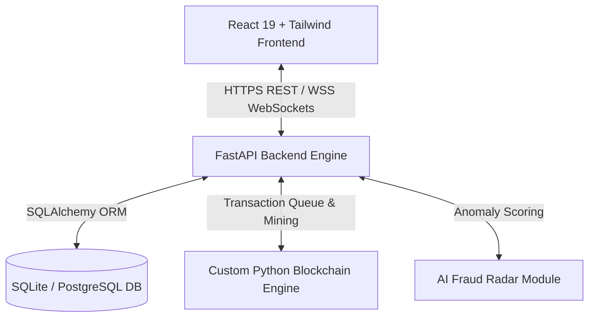

# 📋 Software Requirements Specification (SRS)
## 🛡️ Full-Stack Blockchain Voting System

---

### **Document Information**
- **Project Title**: Cryptographic Blockchain Voting System
- **Version**: 1.0.0
- **Document Standard**: IEEE Std 830-1998 / ISO/IEC/IEEE 29148:2018 Standard
- **Status**: Approved Specification
- **Target Audience**: Software Engineers, Cryptographers, System Administrators, Project Stakeholders, Security Auditors

---

## 1. Introduction

### 1.1 Purpose
The purpose of this Software Requirements Specification (SRS) document is to define the functional, non-functional, security, and architectural requirements for the **Full-Stack Cryptographic Blockchain Voting System**. This document serves as the single source of truth for design, development, verification, and audit of the voting platform.

### 1.2 Scope
The **Blockchain Voting System** is a production-quality, web-based digital voting platform designed to enable secure, tamper-proof, transparent, and anonymous elections. The system utilizes custom cryptographic primitives built from scratch in Python, including:
- **AES-256 GCM** for vote payload encryption.
- **ECDSA (SECP256R1)** digital signatures for transaction authenticity.
- **SHA-256 Merkle Trees** for data integrity inside blocks.
- **Proof-of-Work (PoW)** consensus for block mining and ledger immutability.
- **AI Fraud Radar Module** for velocity anomaly detection, IP concentration risk analysis, and real-time risk scoring (0 - 100%).
- **Downloadable QR Code Receipts** for individual voter verification.
- **Real-Time WebSockets** for live vote tally updates and observer transparency.

### 1.3 Definitions, Acronyms, and Abbreviations
| Term / Acronym | Definition |
| :--- | :--- |
| **AES-256 GCM** | Advanced Encryption Standard with 256-bit key in Galois/Counter Mode. |
| **ECDSA** | Elliptic Curve Digital Signature Algorithm (SECP256R1 curve). |
| **PoW** | Proof-of-Work consensus algorithm requiring computational nonce discovery. |
| **Merkle Tree** | A binary tree of hashes used to efficiently verify the contents of a block. |
| **RBAC** | Role-Based Access Control (`admin`, `voter`, `observer`). |
| **JWT** | JSON Web Token used for stateless authentication and authorization. |
| **SRS** | Software Requirements Specification. |
| **WebSocket** | Full-duplex communication protocol over a single TCP connection. |

### 1.4 References
1. IEEE Std 830-1998: *IEEE Recommended Practice for Software Requirements Specifications*.
2. NIST Special Publication 800-38D: *Recommendation for Block Cipher Modes of Operation: Galois/Counter Mode (GCM)*.
3. SEC 2: *Recommended Elliptic Curve Domain Parameters (SECP256R1)*.
4. FastAPI Documentation: [https://fastapi.tiangolo.com/](https://fastapi.tiangolo.com/)
5. React 19 Documentation: [https://react.dev/](https://react.dev/)

---

## 2. Overall Description

### 2.1 Product Perspective
The system operates as a decoupled, full-stack web application consisting of a React 19 single-page client, a FastAPI asynchronous backend server, a SQLite relational database, and an embedded Python cryptographic blockchain ledger.

### 2.2 User Classes & Characteristics

The platform enforces strict Role-Based Access Control (RBAC) across three distinct user roles:

1. 👑 **Admin**: System administrators who manage elections, add candidates, import voter records via CSV, audit system logs, and inspect AI fraud scores.
2. 🗳️ **Voter**: Verified registered citizens eligible to view active elections, cast encrypted single-vote payloads, receive cryptographic QR receipts, and verify their vote inclusion on the ledger.
3. 👁️ **Observer**: Public auditors, news organizations, or independent election observers who inspect the live blockchain explorer, audit Merkle trees, view real-time vote count tallies, and verify block signatures.

### 2.3 Operating Environment
- **Server Environment**: Python 3.12+, Uvicorn 0.30+, SQLite 3 / PostgreSQL 15+.
- **Client Environment**: Modern web browsers (Google Chrome 120+, Mozilla Firefox 120+, Safari 17+, Microsoft Edge 120+).
- **Deployment Platform**: Standalone Python virtual environment or Docker containers via `docker-compose`.

---

## 3. Specific System Requirements

### 3.1 Functional Requirements

#### 3.1.1 Module 1: Authentication & RBAC Authorization
- **FR-AUTH-01**: The system shall allow users to log in using either their registered username or email address along with a secure password.
- **FR-AUTH-02**: Passwords must be hashed using `bcrypt` prior to database persistence.
- **FR-AUTH-03**: Upon successful login, the system shall issue JWT access tokens (short-lived) and refresh tokens (long-lived).
- **FR-AUTH-04**: Access to API endpoints must be strictly enforced according to user roles (`admin`, `voter`, `observer`).

#### 3.1.2 Module 2: Election & Candidate Management
- **FR-ELEC-01**: Admin users shall be able to Create, Read, Update, and Change Status (`draft`, `active`, `completed`) of elections.
- **FR-ELEC-02**: Admin users shall be able to attach candidate profiles (name, political party, manifesto, avatar URL) to elections.
- **FR-ELEC-03**: Admin users shall be able to import voter rosters in bulk using CSV files containing email and username pairs.

#### 3.1.3 Module 3: Voting Engine & Payload Encryption
- **FR-VOTE-01**: The system shall enforce a strict single-vote constraint per user per active election.
- **FR-VOTE-02**: Before appending a vote transaction to the ledger, the candidate selection payload must be encrypted using **AES-256 GCM**.
- **FR-VOTE-03**: For each vote, the system shall generate a unique voter wallet keypair (**ECDSA SECP256R1**) and sign the transaction hash.
- **FR-VOTE-04**: The system shall record a salted SHA-256 hash (`voter_hash`) instead of the plaintext user identity in transaction payload records to preserve anonymity.

#### 3.1.4 Module 4: Custom Python Blockchain Engine
- **FR-BC-01**: The system shall automatically initialize an immutable Genesis Block (Index 0) upon first startup.
- **FR-BC-02**: Transactions queued in the pending pool shall be mined into new blocks using a **Proof-of-Work (PoW)** difficulty target (e.g. 2 zero-prefix hex characters).
- **FR-BC-03**: Each mined block must calculate and store a **Merkle Root Hash** of all contained transactions.
- **FR-BC-04**: Each mined block must be digitally signed using the system's mining private key.
- **FR-BC-05**: The system shall provide an audit endpoint (`is_chain_valid`) that verifies block hashes, previous hash links, Proof-of-Work difficulty, Merkle tree integrity, and digital signatures across the entire chain.

#### 3.1.5 Module 5: QR Code Receipt & Voter Verification
- **FR-RCPT-01**: Upon successful vote submission, the system shall generate a downloadable PDF/PNG **QR Receipt**.
- **FR-RCPT-02**: The receipt must contain the `tx_hash`, `block_index`, `voter_hash`, and a SHA-256 `receipt_hash`.
- **FR-RCPT-03**: Voters shall be able to input their receipt hash into the Receipt Verification portal to confirm their vote is included in a valid mined block without revealing their candidate selection.

#### 3.1.6 Module 6: Real-Time Observer & Transparency Dashboard
- **FR-OBS-01**: Observers shall have access to a real-time vote tally dashboard powered by WebSockets.
- **FR-OBS-02**: Observers shall be able to inspect individual blocks, transactions, nonces, timestamps, and Merkle tree roots via a interactive Blockchain Explorer.

#### 3.1.7 Module 7: AI Fraud Radar & Anomaly Detection
- **FR-AI-01**: The AI Fraud Radar module shall analyze vote timestamps to identify rapid **velocity bursts** (< 2.0 seconds apart).
- **FR-AI-02**: The module shall detect **IP concentration risk** (e.g. > 5 votes originating from the same IP address).
- **FR-AI-03**: The module shall track duplicate vote attempt audit logs.
- **FR-AI-04**: The module shall compute a unified **Synthetic Fraud Risk Score** (0.0% to 100.0%) and categorize risk into four severity tiers: `Low`, `Medium`, `High`, `Critical`.

---

### 3.2 Non-Functional Requirements (NFR)

#### 3.2.1 Security & Cryptography
- **NFR-SEC-01**: No plaintext candidate selection or plaintext voter identity shall ever be stored in a mined block.
- **NFR-SEC-02**: All client-server network traffic must support HTTPS and Secure WebSockets (`wss://`).
- **NFR-SEC-03**: All private keys generated for digital signatures must be managed in-memory and never written in cleartext to disk.

#### 3.2.2 Performance & Throughput
- **NFR-PERF-01**: REST API endpoint response times shall be less than 200ms for standard read requests.
- **NFR-PERF-02**: Block mining with difficulty = 2 shall complete within 1.0 to 3.0 seconds under normal CPU load.
- **NFR-PERF-03**: WebSocket live updates must broadcast tally changes within 100ms of block confirmation.

#### 3.2.3 Reliability & Immutability
- **NFR-REL-01**: Once a block is mined and appended to the chain, its transactions must be immutable. Any modification to a block payload must render the entire downstream chain invalid.
- **NFR-REL-02**: Database state and block ledger state must remain synchronized across system restarts.

---

## 4. Verification & Compliance Matrix

| Requirement ID | Module | Verification Method | Pass Criteria |
| :--- | :--- | :--- | :--- |
| **FR-AUTH-02** | Authentication | Pytest Unit Test | Passwords hashed with bcrypt cost factor >= 12 |
| **FR-VOTE-01** | Voting Engine | Automated Integration Test | 2nd vote attempt returns HTTP 400 Bad Request |
| **FR-VOTE-02** | Encryption | Cryptographic Inspection | Payload unreadable without AES-256 key |
| **FR-BC-05** | Blockchain Engine | `is_chain_valid` Endpoint | Returns `is_valid: true`, `0 anomalies detected` |
| **FR-AI-04** | AI Fraud Radar | Synthetic Anomaly Test | Risk score updates dynamically based on burst rate |

---
*End of Software Requirements Specification Document.*
