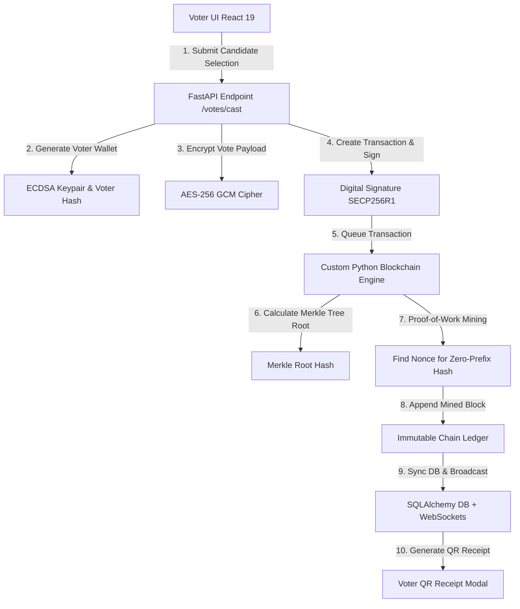

# System Architecture & Cryptographic Workflow

## Overview
The **Blockchain Voting System** guarantees end-to-end vote confidentiality, immutability, and transparency by decoupling voter identity from block transaction content using asymmetric cryptography (ECDSA SECP256R1) and AES-256 GCM vote payload encryption.

## Cryptographic Guarantees
1. **Vote Anonymity**: Votes are stored linked to `voter_hash` derived via SHA-256 salted hashes, never exposing plaintext voter names in blocks.
2. **AES-256 GCM Encryption**: Candidate selections are encrypted before block inclusion.
3. **ECDSA SECP256R1 Digital Signatures**: Every vote transaction is signed using a unique voter private key to verify authenticity.
4. **Merkle Tree Integrity**: Every mined block aggregates transactions into a binary hash tree. Any alteration invalidates the Merkle Root.
5. **Proof-of-Work Ledger**: Miners compute target zero-prefix block hashes, preventing retroactive tampering of previous blocks.
